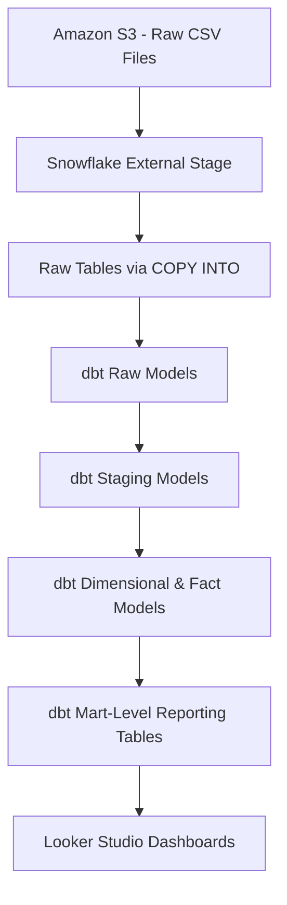

# 🎮 Netflix Data Analytics Pipeline with dbt, Snowflake, S3, and Looker Studio

## 📌 Project Overview

This project demonstrates a real-world data engineering pipeline that ingests, transforms, tests, and visualizes Netflix datasets. Built using Amazon S3, Snowflake, dbt, and Looker Studio, it simulates a modern analytics workflow using the ELT (Extract, Load, Transform) paradigm.

Key features include:

* Cloud-based ingestion from Amazon S3 to Snowflake using COPY INTO
* Role-based access control, warehouse provisioning, schema creation
* Layered transformations using dbt (raw → staging → dim/fact → mart)
* Over 14 dbt tests for data quality validation
* SCD Type 2 implementation using dbt snapshots
* Incremental model execution for source tables
* Analytical dashboards in Looker Studio

---

## 🗂️ Dataset Description

The project uses open-source Netflix-style datasets in CSV format:

* `movies.csv` – Movie ID, title, and genres
* `ratings.csv` – User ratings with timestamps
* `tags.csv` – User-submitted tags
* `genome_scores.csv` and `genome_tags.csv` – Machine-generated tag relevance
* `links.csv` – Movie IDs mapped to IMDb and TMDb

All files are stored in Amazon S3 under the `raw/` folder for ingestion into Snowflake.

---

## 🏧 Architecture Diagram



---

## 🔧 Step-by-Step Instructions

### 1. 🧪 Clone Repository

```bash
git clone https://github.com/your-username/netflix_dbt_project.git
cd netflix_dbt_project
```

### 2. ☁️ Upload CSV Files to S3

* Create an S3 bucket (e.g., `netflixdataset-srujan`)
* Upload all CSVs into the root folder of the bucket

### 3. 🫒 Set Up Snowflake Roles, User, Warehouse, Schema, Stage, and Raw Tables

```sql
-- SQL code as previously detailed including CREATE ROLE, USER, STAGE, TABLES, and COPY INTO
```

### 4. ⚙️ dbt Setup and Execution

#### a. Install and Activate Virtual Environment

```bash
python -m venv venv
source venv/bin/activate  # On Windows use venv\Scripts\activate
pip install dbt-core dbt-snowflake
```

#### b. Configure dbt Profile (`~/.dbt/profiles.yml`)

```yaml
netflix_dbt_project:
  target: dev
  outputs:
    dev:
      type: snowflake
      account: <your_snowflake_account>
      user: dbt
      password: dbtPassword123
      role: TRANSFORM
      database: MOVIELENS
      warehouse: COMPUTE_WH
      schema: RAW
```

#### c. Run dbt Workflow

```bash
dbt deps
dbt seed  # if using any seed files
dbt run   # runs all transformations including incremental models
dbt snapshot  # captures historical changes using SCD2 logic
dbt test  # applies dbt tests (nulls, referential integrity, etc.)
dbt compile
```

### 5. 📊 Visualize with Looker Studio

* Add Snowflake as a data source
* Connect to `MOVIELENS` database and `DEV` schema
* Build charts with:

  * `movie_analysis`
  * `genre_rating_distribution`
  * `user_engagement_summary`
  * `tag_relevance_analysis`
  * `movie_release_trends`

---

## 👌 Key Enhancements

* ✅ **Incremental Models**: Enabled for large tables like `src_ratings`
* ✅ **Snapshots (SCD2)**: Historical tracking of user tag changes using dbt snapshots on `src_tags`
* ✅ **Row-level testing**: Used queries to compare latest inserts and updates

```sql
SELECT * FROM MOVIELENS.DEV.FACT_RATINGS ORDER BY RATING_TIMESTAMP DESC LIMIT 5;
SELECT * FROM MOVIELENS.DEV.SRC_RATINGS ORDER BY rating_timestamp DESC LIMIT 5;
INSERT INTO MOVIELENS.DEV.SRC_RATINGS (user_id, movie_id, rating, rating_timestamp) VALUES (87587, 7151, '4.0', '2015-03-31 23:40:02.000 -0700');
```

---

## 📂 Folder Structure

```
netflix_dbt_project/
├── models/
│   ├── raw/
│   ├── staging/
│   ├── dim/
│   ├── fact/
│   ├── mart/
├── snapshots/
├── macros/
├── seeds/
├── tests/
├── dbt_project.yml
├── packages.yml
└── README.md
```

---

## ✅ Best Practices Followed

* Role-based access control in Snowflake
* Modular dbt folder structure (raw → staging → mart)
* Incremental models for large, frequently changing datasets
* dbt snapshot for slowly changing dimension (SCD Type 2)
* Test coverage: uniqueness, nulls, referential integrity
* Git version control for reproducibility and CI integration
